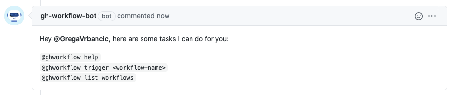

<p align="center">
  
</p>

# GitHub Workflow Bot


[](https://codecov.io/gh/GregaVrbancic/gh-workflow-bot)

> A GitHub App built with [Probot](https://github.com/probot/probot) that triggers GitHub workflows on command.

## Usage

1. **[Configure the GitHub App](https://github.com/apps/gh-workflow-bot)**

2. **Use it in pull requests:**



## Deploy your own instance

If you would like to run your own instance of this app, see the [docs for deployment](https://probot.github.io/docs/deployment/).

This app requires these **Permissions & events** for the GitHub App:

- Action - **Read & write**
- Contents - **Read-only**
- Issues - **Read & write**
  - [x] Check the box for **Issue comment** events
- Repository metadata - **Read-only**
- Pull requests - **Read & write**

## Development

1. Create new Github App (look at previous section for needed permissions)
2. Setup .env file with values (see .env.example)

```sh
# Install dependencies
npm install

# Run in dev mode
npm run dev

# Check code
npm run check-lint

# Fix lint problems
npm run fix-lint

# Run tests with coverage
npm run test

# Run test with reload
npm run test:watch

# Run the bot
npm start
```

## Contributing

If you have suggestions for how gh-workflow-bot could be improved, or want to report a bug, open an issue! We'd love all and any contributions.

For more, check out the [Contributing Guide](CONTRIBUTING.md).

## Credits

Business vector created by [freepik](https://www.freepik.com/free-photos-vectors/business)

## License

[ISC](LICENSE) © 2020 Grega Vrbančič <grega.vrbancic@gmail.com>
